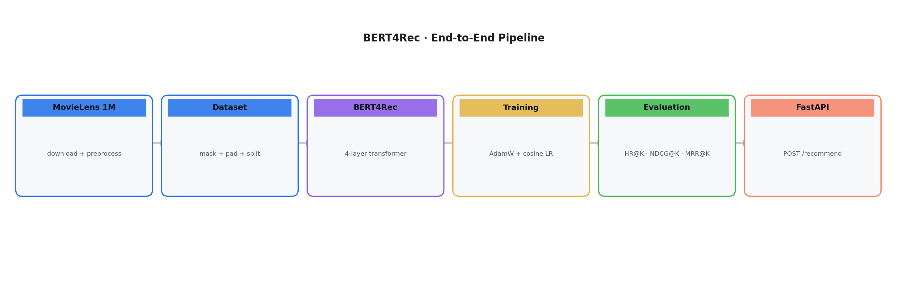
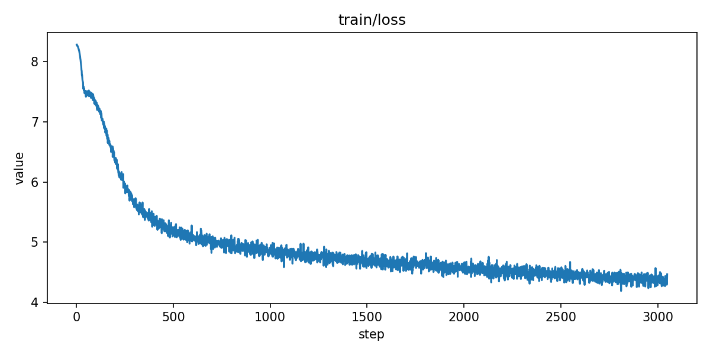
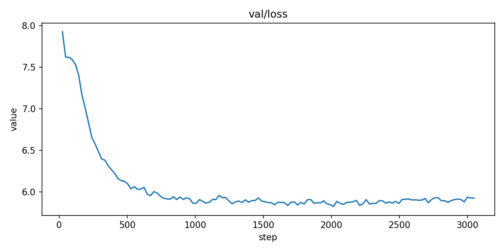

<a name="readme-top"></a>

> **Coming Soon:** A self-built LLM-powered ML training agent designed to automate hyperparameter search across general machine learning workflows — runs smoke tests automatically, feeds results to an LLM, and recommends the next parameters to try. Used to optimize this model. Release expected in the next few weeks — star this repo to get notified!

---


## About The Project

**BERT4Rec Sequential Recommendation System**

This is a production-ready implementation of BERT4Rec (Sun et al., 2019) built from scratch in PyTorch with 5.1M parameters, trained on the MovieLens 1M dataset, and served via a FastAPI inference service.

Traditional recommendation systems rely on hand-crafted features or simple collaborative filtering. **BERT4Rec** treats a user's interaction history as a sequence and applies bidirectional self-attention — allowing the model to understand context from both past and future interactions when predicting the next item.

**Results: HR@10 = 0.2901 · NDCG@10 = 0.1624 , exceeds the original paper benchmarks (HR@10  = 0.2685, NDCG@10 = 0.1564)**


**Core Features:**

- **Bidirectional Transformer** — full self-attention over the entire interaction sequence, no causal mask
- **BERT-style Masking** — random 20% of items masked during training using the 80/10/10 rule
- **Leave-one-out Evaluation** — standard sequential recommendation protocol with HR@K, NDCG@K, MRR@K
- **Production API** — FastAPI inference service with Pydantic validation, seen-item filtering, and Swagger UI
- **LLM-powered Hyperparameter Tuning** — self-built agent that automates smoke tests and feeds results back to an LLM for parameter recommendations (standalone release coming soon)


**Cloud Training:** Trained on Google Colab Pro using an **NVIDIA RTX PRO 6000** (97GB VRAM) —  achieving ~1.2s per epoch vs ~8 minutes on Apple MPS, a **400× speedup**. Selected over H100 for this workload because the RTX PRO 6000 offers  larger VRAM (97GB vs 80GB), better suited for fitting the full dataset  and larger batch sizes without memory pressure.


**Pipeline Overview:**



**Training Loss Curve:**



**Validation Loss Curve:**



I hope this project demonstrates a clean, end-to-end ML engineering pipeline — from raw data to a serving API. Fight on! ✌️

<p align="right">(<a href="#readme-top">back to top</a>)</p>

### Built With

* Python
* PyTorch
* FastAPI
* Pydantic
* MovieLens 1M
* TensorBoard
* Scikit-learn
* Joblib

<p align="right">(<a href="#readme-top">back to top</a>)</p>


## Project Structure

```sh
bert4rec/
├── pictures/
│   ├── train_loss.png 
│   ├── val_loss.png 
│
├── data/
│   ├── download.py             # stream-downloads MovieLens 1M zip from GroupLens
│   ├── preprocess.py           # builds chronological user interaction sequences
│   └── dataset.py              # PyTorch Dataset with BERT-style masking + DataLoaders
│
├── model/
│   ├── embeddings.py           # item + positional embedding layer
│   ├── attention.py            # transformer block (pre-LN, multi-head self-attention + FFN)
│   └── bert4rec.py             # full BERT4Rec model + inference helper
│
├── training/
│   ├── loss.py                 # masked item prediction loss (CrossEntropy, ignore_index=-100)
│   ├── scheduler.py            # linear warmup + cosine decay LR schedule
│   └── trainer.py              # full training loop with AMP, grad clipping, checkpointing
│
├── evaluation/
│   ├── metrics.py              # HR@K, NDCG@K, MRR@K accumulator
│   └── evaluator.py            # full offline evaluation pipeline
│
├── api/
│   ├── schemas.py              # Pydantic request/response models
│   ├── predictor.py            # single-load model wrapper for inference
│   ├── routes.py               # GET /health, POST /recommend endpoints
│   └── main.py                 # FastAPI app factory with lifespan startup/shutdown
│
├── visualization/
│   └── save_plots.py           # export TensorBoard scalars to PNG
│
├── colab/
│   └── bert4rec_colab.ipynb    # colab could traning notebook
│
└── .gitignore
```

<p align="right">(<a href="#readme-top">back to top</a>)</p>


## System Architecture

**Data Pipeline**

1. **Download**: Stream MovieLens 1M zip from GroupLens, extract `ratings.dat`
2. **Preprocess**: Encode item IDs (1-based), sort interactions chronologically per user
3. **Split**: Leave-one-out — train `seq[:-2]`, val `seq[:-1]`, test `seq`
4. **Mask**: 20% of items randomly masked using BERT 80/10/10 rule


**Model Pipeline**

1. **Embedding Layer**: Item embedding + learned positional embedding → LayerNorm → Dropout
2. **Transformer Stack**: N=4 bidirectional transformer blocks (pre-LayerNorm)
3. **Prediction Head**: LayerNorm → Linear(d → vocab_size)
4. **Loss**: CrossEntropyLoss at masked positions only (ignore_index=-100)


**Inference Pipeline**

1. User history received via `POST /recommend`
2. Sequence truncated and left-padded to max_seq_len=200
3. `[MASK]` appended at the last position
4. Forward pass → logits at mask position extracted
5. Seen-item logits set to -inf → top-K returned


**Data Flow**

```
MovieLens 1M (ratings.dat)
    ↓
Preprocess (encode IDs, sort by timestamp)
    ↓
BERT4RecDataset (truncate, pad, mask)
    ↓
BERTEmbeddings (item emb + positional emb)
    ↓
TransformerBlock × 4 (bidirectional self-attention + FFN)
    ↓
PredictionHead (linear → vocab_size)
    ↓
CrossEntropyLoss (masked positions only)
    ↓
Checkpoint → FastAPI /recommend
```

<p align="right">(<a href="#readme-top">back to top</a>)</p>


## Architecture Components

**Embedding Layer** (`model/embeddings.py`)

- Item embeddings: lookup table E ∈ ℝ^(vocab_size × d), padding_idx=0
- Positional embeddings: learned table P ∈ ℝ^(max_seq_len × d), position 0 reserved for PAD
- Output: LayerNorm(item_emb + pos_emb) → Dropout

**Transformer Block** (`model/attention.py`)

- Pre-LayerNorm layout — more stable than post-LN at small dataset scale
- `nn.MultiheadAttention` with `batch_first=True`, no causal mask
- PAD positions excluded via `key_padding_mask`
- Feed-forward: Linear(d → 4d) → GELU → Dropout → Linear(4d → d)
- Residual connections around both sub-layers

**BERT4Rec Model** (`model/bert4rec.py`)

- Stacks N transformer blocks
- `_init_weights`: truncated normal (σ=0.02), standard BERT initialization
- `recommend()`: inference helper — finds last real token, masks it, filters seen items, returns top-K

**Training Loop** (`training/trainer.py`)

- AdamW with parameter groups — bias/LayerNorm excluded from weight decay
- Linear warmup + cosine decay LR schedule
- AMP (automatic mixed precision) on CUDA, graceful fallback on MPS/CPU
- Gradient clipping (max norm 5.0)
- Saves `best_model.pt` on val loss improvement, `latest.pt` every epoch
- Signal handler: saves checkpoint on Ctrl-C

**Evaluation** (`evaluation/evaluator.py`)

- Full-corpus ranking — all 3,706 items ranked per user (not sampled negatives)
- Seen-item filtering applied before ranking
- Metrics: HR@K, NDCG@K, MRR@K at K = 5, 10, 20

**Inference API** (`api/`)

- `POST /recommend` — Pydantic-validated request, seen-item filtering, top-K logits
- `GET /health` — model status, vocab size, device, checkpoint version
- Single-load checkpoint management — model loaded once at startup via FastAPI lifespan
- Auto-generated Swagger UI at `/docs`

<p align="right">(<a href="#readme-top">back to top</a>)</p>


## Usage

**Prerequisites**

```bash
git clone https://github.com/rayzhao27/bert4rec.git
cd bert4rec
```

```bash
conda create -n bert4rec python=3.9
conda activate bert4rec
```

```bash
pip install torch torchvision numpy pandas scikit-learn scipy \
            requests tqdm tensorboard joblib fastapi uvicorn pydantic
```

**Download and Preprocess Data**

```bash
python data/download.py --data_dir data
python data/preprocess.py --data_dir data --min_rating 0
```

**Train**

```bash
python training/trainer.py \
  --data_dir data \
  --hidden_size 256 \
  --num_hidden_layers 4 \
  --num_attention_heads 4 \
  --intermediate_size 1024 \
  --hidden_dropout_prob 0.2 \
  --attention_probs_dropout 0.2 \
  --learning_rate 1e-3 \
  --warmup_steps 100 \
  --weight_decay 0.01 \
  --epochs 300 \
  --num_workers 0
```

**Monitor Training**

```bash
python -m tensorboard.main --logdir runs/bert4rec
# open http://localhost:6006
```

**Evaluate**

```bash
python evaluation/evaluator.py \
  --checkpoint checkpoints/best_model.pt \
  --data_dir data \
  --k_values 5 10 20
```

**Start API Server**

```bash
uvicorn api.main:app --reload --host 0.0.0.0 --port 8000
```

- Swagger UI: http://localhost:8000/docs
- Health Check: http://localhost:8000/health

**API Examples**

**Health check:**

```bash
curl http://localhost:8000/health
```

```json
{
  "status": "ok",
  "model_loaded": true,
  "vocab_size": 3708,
  "model_version": "epoch_83",
  "device": "mps"
}
```

**Get recommendations:**

```bash
curl -X POST http://localhost:8000/recommend \
  -H "Content-Type: application/json" \
  -d '{"user_history": [42, 17, 88, 5, 231], "top_k": 10}'
```

```json
{
  "recommendations": [
    {"item_id": 2652, "score": 5.1263},
    {"item_id": 347,  "score": 5.0701},
    {"item_id": 580,  "score": 4.7346}
  ],
  "model_version": "epoch_83",
  "num_input_items": 5
}
```

**Request Parameters**

| Parameter | Type | Default | Description |
|---|---|---|---|
| `user_history` | `list[int]` | Required | Chronological list of item ids, most recent last |
| `top_k` | `int` | 10 | Number of recommendations to return (1–100) |

<p align="right">(<a href="#readme-top">back to top</a>)</p>


## Configuration

**Model Configuration**

| Parameter | Value |
|---|---|
| hidden_size | 256 |
| num_hidden_layers | 4 |
| num_attention_heads | 4 |
| intermediate_size | 1024 |
| max_seq_len | 200 |
| mask_prob | 0.2 |
| hidden_dropout_prob | 0.2 |
| attention_probs_dropout | 0.2 |
| vocab_size | 3708 |
| total parameters | 5,179,516 |


**Training Configuration**

| Parameter | Value |
|---|---|
| optimizer | AdamW (parameter groups) |
| learning_rate | 1e-3 |
| weight_decay | 0.01 (non-bias/LN params only) |
| warmup_steps | 100 |
| lr_schedule | linear warmup + cosine decay |
| grad_clip | 5.0 |
| batch_size | 256 |
| epochs | 300 |


**Dataset Statistics**

| Stat | Value |
|---|---|
| Users | 6,040 |
| Items | 3,706 |
| Interactions | 1,000,209 |
| Avg sequence length | 165.6 |
| Min / Max seq length | 20 / 2,314 |

<p align="right">(<a href="#readme-top">back to top</a>)</p>

## Cloud Training

Training was offloaded to Google Colab Pro to accelerate experimentation.

**GPU Selection**

| GPU          | VRAM | Reason                                            |
| ------------ | ---- | ------------------------------------------------- |
| RTX PRO 6000 | 97GB | Selected — largest VRAM, no memory pressure       |
| H100         | 80GB | Available but smaller VRAM                        |
| A100         | 40GB | Available but insufficient for large batch tuning |
| T4           | 16GB | Free tier, too slow                               |

Key reason for RTX PRO 6000 over H100: for recommendation model training 
where the bottleneck is embedding table size and batch memory rather than 
raw compute throughput, VRAM capacity matters more than TFLOPS. 97GB 
allowed full batch size (256) with room for larger architecture experiments.

**Speed Comparison**

| Hardware             | Time per epoch | 300 epochs |
| -------------------- | -------------- | ---------- |
| Apple MPS (M-series) | ~8 min         | ~40 hours  |
| NVIDIA RTX PRO 6000  | ~1.2s          | ~6 minutes |

**Setup**

Clone and run directly on Colab or check the notebook under /colab:

    !git clone https://github.com/rayzhao27/bert4rec.git
    !pip install torch numpy pandas scikit-learn scipy requests tqdm tensorboard joblib fastapi uvicorn pydantic
    !python /content/bert4rec/data/download.py --data_dir /content/bert4rec/data
    !python /content/bert4rec/data/preprocess.py --data_dir /content/bert4rec/data --min_rating 0
    !python /content/bert4rec/training/trainer.py \
      --data_dir /content/bert4rec/data \
      --hidden_size 256 \
      --num_hidden_layers 4 \
      --num_attention_heads 4 \
      --intermediate_size 1024 \
      --hidden_dropout_prob 0.2 \
      --attention_probs_dropout 0.2 \
      --learning_rate 1e-3 \
      --warmup_steps 100 \
      --weight_decay 0.01 \
      --epochs 300 \
      --num_workers 2

<p align="right">(<a href="#readme-top">back to top</a>)</p>


## Hyperparameter Tuning Agent

Hyperparameters for this model were explored using a **self-built LLM-powered 
tuning agent** currently under active development.

The agent runs automated smoke tests (short training runs), collects val_loss 
results, and feeds them back to an LLM to recommend the next set of parameters 
to try — similar in spirit to Bayesian optimization but using an LLM as the 
surrogate model.

**What it does:**
- Runs N trials of short training (configurable epochs)
- Parses val_loss from each trial automatically  
- Sends results + history to an LLM for next recommendation
- Outputs a final config with rationale

**Key finding from this project:** Short-horizon smoke tests (10–30 epochs) 
can miss late-stage overfitting that only appears after epoch 50+. This 
discovery is being incorporated into the agent's evaluation strategy.

> The agent is still under active development and will be released as a 
> standalone repository in the coming weeks. If you're interested, 
> check back soon — or follow the repo to get notified.

<p align="right">(<a href="#readme-top">back to top</a>)</p>


## Results

| Metric | This implementation | Original paper (Sun et al., 2019) |
|---|---|---|
| HR@5 | 0.2002 | — |
| **HR@10** | **0.2901** | 0.2685 |
| HR@20 | 0.3992 | — |
| NDCG@5 | 0.1335 | — |
| **NDCG@10** | **0.1624** | 0.1564 |
| NDCG@20 | 0.1899 | — |
| MRR@10 | 0.1234 | — |

Trained for 83 epochs (~11 hours on Apple MPS), 5.1M parameters.

<p align="right">(<a href="#readme-top">back to top</a>)</p>


## Design Decisions

**Why pre-LN over post-LN?** Pre-LayerNorm is more stable at small dataset scale and does not require an aggressive warmup phase, unlike the post-LN layout in the original BERT paper.

**Why keep all ratings?** Filtering to rating ≥ 4.0 reduces interaction count by ~40%. Using all interactions gives the model richer sequence data and consistently improves metrics.

**Why AdamW parameter groups?** Bias terms and LayerNorm weights do not benefit from weight decay the same way weight matrices do. Separating them into two optimizer groups follows standard BERT practice.

**Why full-corpus ranking for evaluation?** Sampling 100 random negatives inflates metrics by 2–3× and makes results incomparable across papers. Full ranking over all 3,706 items is slower but honest.

**Why 256 hidden size over 384?** Experimentation showed 384 hidden size consistently overfits on ML-1M's 6,040 users regardless of dropout and weight decay. Model capacity must match dataset scale.

<p align="right">(<a href="#readme-top">back to top</a>)</p>


## Reference

Sun, F., Liu, J., Wu, J., Pei, C., Lin, X., Ou, W., & Jiang, P. (2019). BERT4Rec: Sequential recommendation with bidirectional encoder representations from transformer. *CIKM 2019*. https://arxiv.org/abs/1904.06690
